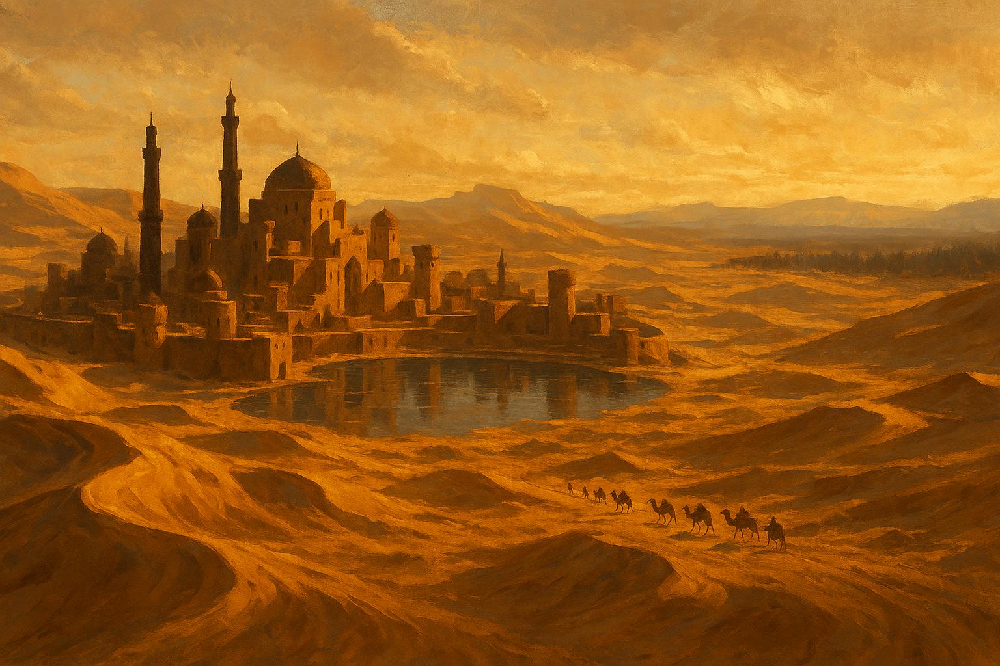

# World Page Builder — City of Exiles

## Task Description

This prompt builds the **home page** of the *City of Exiles* site — the root
landing page at `docs/index.md`. It reads the campaign's world sources and turns
them into an evocative, well-linked introduction to the setting, then generates a
hero image for the top of the page.

Run this whenever the world bible or its notes change, or when you want to refresh
the home page. It is separate from `SESSION_SUMMARIZER.md` (which handles sessions
and the wiki).

---

## Input Sources

### World Folder
Read **every** `.md` file in `world/`:

- `world/world.md` — the canonical Erratt campaign bible (nations, races, factions,
  geography, pantheon, and Utsa Paradisa — the City of Exiles).
- `world/*-notes.md` (optional) — any supplementary world notes. Fold their content
  into the page where relevant; do not list them separately.

### Existing Home Page
`docs/index.md` — read it first. It already contains a `## Sessions` table that is
maintained by `SESSION_SUMMARIZER.md`. **Preserve that table exactly** — this prompt
only rewrites the narrative body above it.

### Wiki
`docs/wiki/` — use it to cross-link. When the body mentions a location, NPC, or
faction that has a wiki page, link to it.

---

## Output Required

Rewrite `docs/index.md` with the following structure:

1. **Frontmatter** — keep it as:
   ```yaml
   ---
   title: "Home"
   ---
   ```

2. **Hero image** — generate one (see below) and embed it at the very top of the
   body, right under the `# City of Exiles` H1:
   ```markdown
   { .home-hero }
   ```

3. **Introduction** — 2–3 short paragraphs welcoming the reader to the world of
   **Erratt** and the campaign's starting city, **Utsa Paradisa** — a desert oasis
   and haven for exiles. Set the tone: scarcity, sacred water, outcasts carving out
   belonging in the long shadow of the Schism.

4. **Curated sections** — a handful of `##` sections drawn from the world sources,
   each 1–2 tight paragraphs, e.g.:
   - **The Schism** — the cataclysm that shaped every border and grudge.
   - **The City of Exiles** — Utsa Paradisa: who lives there, why water is power,
     Empress Selene's diplomacy, the UkRuundir trade lifeline. Link
     [Utsa Paradisa](wiki/locations/utsa-paradisa.md) and other wiki pages.
   - **The Wider World** — the great nations (Trivan, the Iron Holds, Drathomir,
     Medui-Ghislerin) and the Northern Territories, kept brief.

   Keep it a **landing page**, not a copy of the bible — invite the reader in and
   link out to the wiki and sessions for depth. Link a name on first mention only.

5. **Sessions** — keep the existing `## Sessions` heading and its table at the very
   bottom, unchanged.

---

## Hero Image

Before writing the file, generate the hero image. First load your keys (once per
shell), then run the generator:

```bash
set -a; source .env; set +a
python3 bin/gen-image.py \
  --prompt "A sweeping vista of Utsa Paradisa, the City of Exiles: a desert oasis city of sandstone and tar, ringed by dunes under a vast sky, sacred guarded waters at its heart, distant caravans crossing toward a cold northern forest" \
  --out docs/assets/home-hero.png \
  --size 1536x1024
```

The script appends the shared desert style automatically. If it exits non-zero
(e.g. `OPENAI_API_KEY` not set), surface the error and stop — do not embed a
missing image. The `.home-hero` class is styled in `docs/stylesheets/extra.css`.

---

## Notes

- Do **not** modify `mkdocs.yml`, the wiki, or session files — only `docs/index.md`
  and the generated `docs/assets/home-hero.png`.
- Keep names, places, and lore consistent with `world/world.md`.
- Preview with `mkdocs serve`, then commit `docs/` to publish (see `README.md`).
