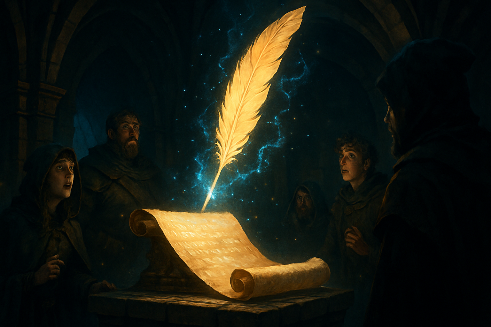

# Session 9 — The Scribe's Final Test

*The Shattered Realm · June 4, 2026*

---

## The Scribe's Enchantment

> The dungeon master's voice resonated through the chamber, a melodious incantation guiding the scribe's quill across the parchment. A hush settled over the room, all eyes fixed upon the magical script that appeared, transcending mere words into the tapestry of their grand adventure.

---

## Overview

In the depths of anticipation, the dungeon master eagerly awaited the final assessment of a mystical scribe's abilities. This was no ordinary trial, but a test to discern whether the magic of the written word could capture the essence of storytelling itself within the realm. The stakes were high, for should the spell succeed, the chronicles of their adventures would be preserved for eternity.

As the players gathered, the air was thick with expectation and a touch of anxiety. The participants held their breath, aware that they stood on the precipice of potentially unlocking a new dimension of their journey. The dungeon master, resolute and hopeful, initiated the incantation. They knew that this experiment could change the very nature of their campaign, enhancing both the depth and immersion for all involved.

## Key Events

### The Scribe's Challenge

The dungeon master introduces the scribe, an enigmatic figure capable of recording the essence of their quests. This introduction sets the tone for the night's test.

### Initiating the Test

With a deep breath, the dungeon master begins the trial, hoping the scribe will accurately capture the narrative without error.

### Awaiting Success or Failure

As the enchantment unfolds, the group is suspended in a moment of uncertainty, waiting to see if the scribe will succeed or falter.

### Anticipation

The players feel the weight of potential change, realizing that this trial could alter how they experience their ongoing saga.
