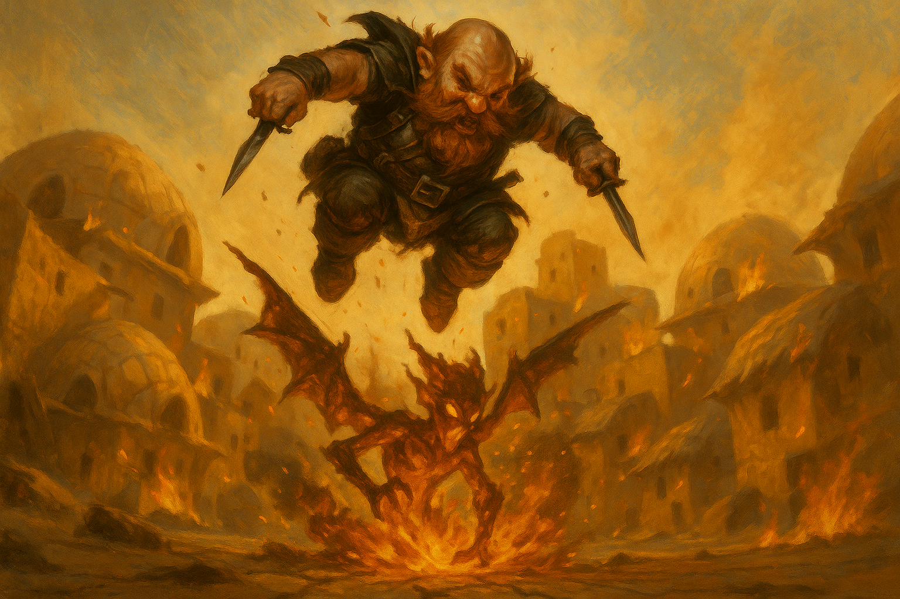

# Session One — The Tidewater Amulet

*July 3, 2026*

## Overview

With [Utsa Paradisa](../wiki/locations/utsa-paradisa.md) still reeling from a
citywide assault, the party fought through the Slums and the Jade District to beat
back an invasion of fey and elemental creatures. They saved a district and a family
— but arrived at [the Water Temple](../wiki/locations/the-water-temple.md) too late
to stop the abduction of the water priestess
[Nybora Tidewater](../wiki/npcs/nybora-tidewater.md), who left behind a talking
amulet that would set the party's next quest in motion.

## Key Events

- **Aftermath and triage.** In the ransacked [Bazaar](../wiki/locations/the-bazaar.md),
  the party freed [Major Jamieson](../wiki/npcs/major-jamieson.md), a guard the
  suture flies had stitched together — hands sewn to his thighs, lips sewn shut —
  through a tense run of medicine checks and healing. The Major swore that his
  fellow guard [Charles Gambit](../wiki/npcs/charles-gambit.md), who fled the fight,
  would be scrubbing his office when it was over.
- **Choosing the fight.** The Griffin rider [Cerus](../wiki/npcs/cerus.md) flew an
  aerial recon (natural 20) and laid out the city's wounds: the
  [University](../wiki/locations/the-university.md) held, the
  [Slums](../wiki/locations/the-slums.md) were battered, and the
  [Jade District](../wiki/locations/the-jade-district.md) — home of the Griffins and
  the Water Temple — was under the heaviest attack. Cerus peeled off to defend her
  Griffins; the party marched on the Slums, drawn by
  [Behnsun Payne](../wiki/pcs/behnsun-payne.md)'s orphanage and
  [Adarius](../wiki/pcs/adarius.md)'s parents.
- **The battle for the Slums.** Amid the tortoise-shell homes, the party fought
  magma mephits, suture flies, and a thirster. A mephit's breath cone caught
  Adarius's father — critically — and burned half his face, but the hardy man
  survived. [Patty Greenfoot](../wiki/npcs/patty-greenfoot.md) and
  [the Dragonborn Band](../wiki/npcs/the-dragonborn-band.md) — old rivals from a
  chariot race — turned up to buoy the party with inspiring music.
- **The Water Temple falls.** Pressing on to the Jade District, the party found
  suture flies sewing [Nybora Tidewater](../wiki/npcs/nybora-tidewater.md)'s mouth
  and hands shut. Despite the veteran commander
  [Dalen Marr](../wiki/npcs/dalen-marr.md)'s stand, the flies lifted the priestess
  and carried her out of the city.
- **The dropped clue.** As she was flown away, Nybora left behind a gold teardrop
  amulet. Adarius's *identify* revealed "something trapped inside" — a fey being
  that rejected him outright ("you were not chosen") and turned to
  [Prance Galavant](../wiki/pcs/prance-galavant.md): "You will do. You must save my
  daughter." Prance swore an oath to the
  [Amulet Speaker](../wiki/npcs/the-amulet-speaker.md), put the amulet on, and felt
  "a spark of magic click."

## Memorable Moments

- **Death from above.** The party spent whole turns building a catapult mid-battle —
  a natural-20 contraption — and used it twice: first flinging Prance across the
  field, then launching [Krum](../wiki/pcs/krum.md) some 80 feet through the air to
  crash down on a fire mephit, driving both daggers through it and squashing the
  creature into the cracked earth.
- **A 39-damage flourish.** Prance's brutal-critical longsword swing, delivered
  mid-monologue — "only when it's most dramatic."
- **"Healing is my game."** Behnsun Payne introduced himself to the freed Major
  Jamieson in rhyme, then later froze a fire mephit with a *chromatic orb* of cold.
- **Talking to furniture.** [Fizz](../wiki/pcs/fizz.md) held his amulet
  [Frederick](../wiki/npcs/frederick.md) up to the new one and "made them kiss,"
  drawing drops of water from the teardrop — and learned that he, too, had been
  "chosen."
- **The world's grumpiest quest-giver.** The amulet snapping at Adarius: "I have
  feelings, and my daughter was just kidnapped. I'm having a bad day."

## Open Threads

- **Where is Nybora Tidewater?** The suture flies carried her out of the city
  alive. Who sent them to silence a water-priestess — and to what end?
- **The amulet's nature.** [The Amulet Speaker](../wiki/npcs/the-amulet-speaker.md)
  claims to be Nybora's father, trapped in the teardrop. What is he, how was he
  bound, and what does it mean that both Prance and Fizz have been "chosen"?
- **Two chosen, two amulets.** Frederick named the Tidewater spirit a "brother" but
  admitted he isn't sure he trusts him. How are the two fey vessels — and their
  bearers — connected?
- **The city's attackers.** The fey and elemental creatures were beaten back "for
  now," but no one learned who unleashed them.
- **Adarius's dissent.** Adarius rolled his way to genuine conviction that the
  amulet is bad news and still wants to sell it. That fault line isn't resolved.

## The Scene

The catapult had already thrown Prance once, and the party — half-mad on the sheer
audacity of it — had built the thing back up for another shot. Krum climbed into the
sling without a word of complaint, because a dwarf does not complain about being
turned into ammunition; a dwarf simply checks that his daggers are loose in their
sheaths. Below him the Slums burned in patches, the hollowed tortoise-shell homes
throwing long shadows across the dust, and out among them a fire mephit hovered on
crackling wings, chuckling that small fiendish chuckle that had been fraying
everyone's nerves for an hour. "On three," Fizz called, bracing the frame. Krum did
not wait for three.

He went up and the world went quiet. For one long breath there was only wind and the
thump of his own heart and the whole ruined district tilting beneath him — eighty
feet of desert air with a burning imp at the bottom of it. The mephit looked up a
half-second too late. It had time to widen its ember eyes and no time at all to move.

Krum came down like a dropped anvil with a grudge. Both daggers led the way, punched
to the hilt through the creature's molten hide, and his full dwarven weight followed
after — driving the thing straight down, flattening it into the cracked earth in a
spray of sparks and a smell of burnt tar. The fire went out of it all at once, snuffed
under a hundred and some pounds of rogue. Krum wrenched his blades free, stood up in
the little crater he'd made, and dusted off his shoulders while the embers settled
around his boots. Somewhere behind him, Prance was already announcing that *this*,
too, would make a magnificent verse.
