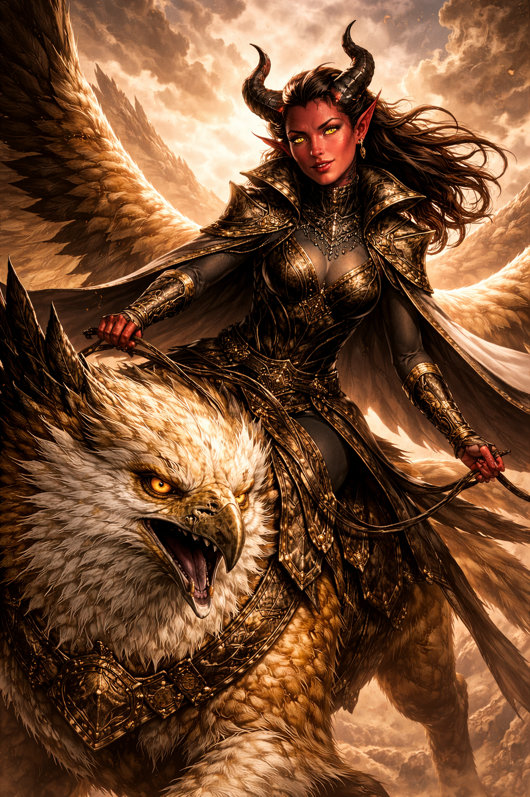

# Glidershade

{ .wiki-image .wiki-portrait }

**Role:** Griffon of the Jade District · **Rider:** [Seris](seris.md)

## Overview

The griffon ridden by [Seris](seris.md), and one of the beasts of the Griffin
roost in [the Jade District](../locations/the-jade-district.md). Glidershade took
a liking to the party after [Prance](../pcs/prance-galavant.md) so impressed the
beast in an earlier session.

## Session History

- **[The Tidewater Amulet](../../sessions/2026-07-03.md)** — Carried Seris on her
  aerial reconnaissance over the city, then flew with her to defend the Jade
  District against the heaviest of the assault.
